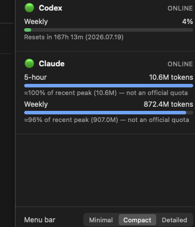

# Agent Status

**AI Agent Usage & Status Monitor** — every AI agent's limits, resets, and
cost, in one menu bar.

[](https://github.com/uulab-official/agent-status/actions/workflows/ci.yml)
[](LICENSE)

[한국어 README](README.ko.md) · [Roadmap](ROADMAP.md) · [Architecture](docs/architecture.md) · [Contributing](CONTRIBUTING.md)

> Status: **pre-1.0, actively developed.** Ollama, Custom endpoints,
> OpenRouter, Codex, Claude, and Antigravity all report real, verified-live
> usage data today (not just detection) — see the table below for exactly
> which. Cursor/Gemini/Copilot are connectivity-only for now (real quota
> data is blocked on either a missing vendor API or a credential-store read
> this project won't do — see each provider's README). See
> [ROADMAP.md](ROADMAP.md) for the exact done/planned line and a running
> log of real bugs found and fixed.

## The problem

Checking whether you're about to hit a rate limit today looks like this,
repeated per tool, several times a day:

```
Claude → open browser → Settings → Usage → read the number
GPT     → same, different tabs
Gemini  → same
Cursor  → same
```

## What this is

A macOS menu bar / Windows tray app — think **Raycast + iStat Menus +
Activity Monitor, but for the AI tools you're already paying for** — that
stays running and shows every provider's usage in one glance:

```
🤖 72%              ← compact: worst usage across all providers
🤖 C82 G41 O99      ← detailed: per-provider initial + top usage
```

Click it, get the breakdown — a real screenshot, not a mock:



Note the two different kinds of number in the same popover: Codex's
percentage is a real, server-reported quota (with a real reset date);
Claude's is explicitly labeled as an estimate, because Anthropic doesn't
expose a real plan-cap percentage anywhere locally observable — see
[docs/confidence.md](docs/confidence.md) for why this distinction is a
first-class part of the data model, not an afterthought.

This click-to-open popover, the tray label itself, and the settings row
(menu bar mode, Launch at Login) all work today — see
[src-tauri/README.md](src-tauri/README.md) for exactly what's been run and
verified.

## Built with Rust + Tauri, not Electron

A menu-bar utility that watches other programs' resource usage shouldn't
itself be one of the heaviest things running — bundling a full Chromium +
Node runtime for a small tray icon is a real irony worth avoiding. This
project started as a TypeScript/Electron prototype and was rewritten to
Rust/Tauri before its first commit for exactly that reason. See
[docs/architecture.md](docs/architecture.md#why-rust--tauri-not-electron)
for the full trade-off discussion.

## Why not a hosted dashboard, either?

Every provider's usage API/screen changes shape without notice. A hosted
aggregator means one team chasing every vendor's changes, for every user,
forever. Instead, each provider is an isolated plugin that translates
whatever it can observe (an API, a CLI's local state, a scraped page) into
one shared shape. Losing a provider — or a vendor changing their usage page
— means fixing one small crate, not the whole app. See
[docs/architecture.md](docs/architecture.md) for the full reasoning.

## Supported / planned providers

| Provider | Status | Confidence target |
|---|---|---|
| [Ollama](crates/providers/ollama) | ✅ Fully implemented | ★★★★★ official local API |
| [Custom / OpenAI-compatible](crates/providers/custom) (LM Studio, AnythingLLM, Open WebUI) | ✅ Fully implemented | ★★★★★ |
| [OpenRouter](crates/providers/openrouter) | ✅ Fully implemented | ★★★★★ API |
| [Codex](crates/providers/codex) | ✅ Fully implemented | ★★★☆☆ CLI log (`~/.codex/sessions` rate limits) — real 5-hour/weekly percentages, falls back to `codex login status` |
| [Cursor](crates/providers/cursor) | ✅ Real connectivity check | ★★★☆☆ CLI (`cursor-agent status`); ★★★★☆ dashboard quota deliberately not pursued (needs a session cookie — see its README) |
| [Claude](crates/providers/claude) | ✅ Fully implemented | ★★★☆☆ CLI log (`~/.claude` session transcripts) — token counts, no plan-cap percentage |
| [OpenAI / ChatGPT](crates/providers/openai) | ✅ Fully implemented (platform API cost) | ★★★★★ Admin Costs API — ChatGPT plan message caps (★★☆☆☆ browser) still TODO |
| [Gemini](crates/providers/gemini) | ✅ Real connectivity check | ★★★★★ API key validity + model list — no usage/quota endpoint exists to call |
| [GitHub Copilot](crates/providers/copilot) | 🚧 Blocked — see its README | ★★★★★ API (v1.5) |
| [Antigravity](crates/providers/antigravity) | ✅ Fully implemented | ★★★☆☆ CLI log (local quota cache) — closest-to-limit recommended model, staleness-gated |

Confidence tiers are a first-class part of the data model, not a footnote —
see [docs/confidence.md](docs/confidence.md) for why and
[docs/plugin-development.md](docs/plugin-development.md) for how to finish
one of the 🚧 providers above.

## Repository layout

```
src-tauri/     The Tauri application — tray icon, popover window,
               scheduler, and the only crate that composes every provider
ui/            Static popover frontend (HTML/CSS/vanilla JS, no build step)
crates/
  core/          Standard status model + ProviderPlugin trait
  plugins-common/ BasePluginState scaffolding shared by every provider
  database/      SQLite schema + settings (rusqlite)
  notifications/  Threshold-based notification engine
  tray-label/    Pure tray-label formatting
  providers/
    claude/ openai/ gemini/ cursor/ copilot/ codex/ ollama/ openrouter/ custom/
docs/          Architecture, data model, confidence levels, plugin guide
```

## Getting started (development)

Requires the Rust toolchain (`rustup`) — no Node/npm needed.

```bash
cargo build --workspace
cargo test --workspace
```

See [src-tauri/README.md](src-tauri/README.md) for running the actual app,
including a real quirk we hit testing the tray icon manually on macOS (menu
bar auto-hide + synthetic clicks).

## For AI coding agents working in this repo

See [CLAUDE.md](CLAUDE.md) (Claude Code) and [AGENTS.md](AGENTS.md)
(Codex / other agents) for repo-specific conventions before making changes.

## Contributing

See [CONTRIBUTING.md](CONTRIBUTING.md). The single highest-leverage
contribution right now is finishing a `fetch_status()` implementation for
one of the 🚧 providers — see [docs/plugin-development.md](docs/plugin-development.md).

## License

[MIT](LICENSE)
